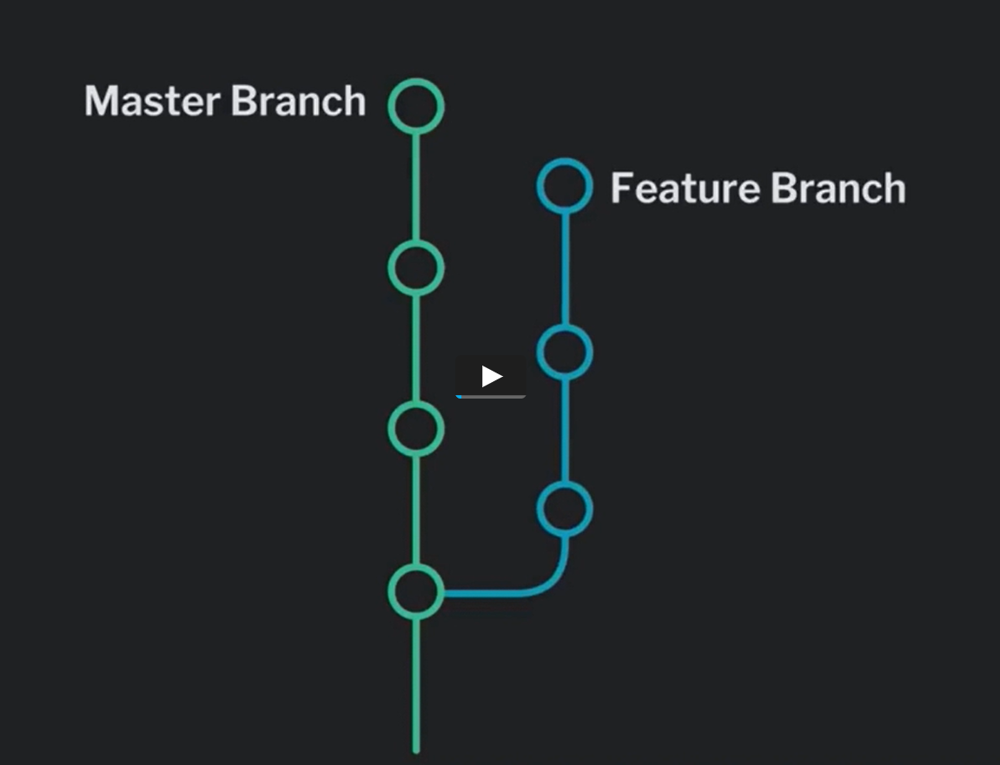
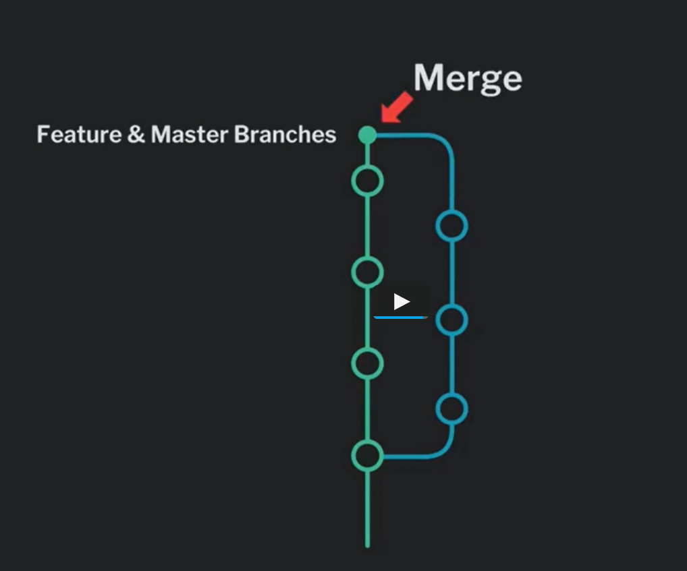

# GitITDone

https://doodle.com/meeting/participate/id/5eVnxxoe

## Inleiding

### Noodzaak versie controle

We hebben het allemaal al vast meegemaakt in het middelbaar wanneer we in groep aan een taak moesten werken.
Nadat we allemaal de bestanden naar elkaar doorgestuurd hebben eindigen we met 3 verschillende versies van de taak met namen zoals taak.docx, taak1.docx, taakFINAAL.docx.
In de IT wereld werken hele departementen aan één codebase en dan is dat absoluut geen manier van werken. Er is nood aan een systeem dat de verschillende versies van de documenten en code bij houd. Een *version control system*.

### GIT?

Een technologie die ons hier bij kan helpen is *git*. Git is bedacht en ontworpen in 2005 door Linus Torvalds (de maker van Linux) en is dus gemaakt voor de Unix command interface. Git houdt alle code en files bij in een repo*sitory*. Ondertussen bestaan er ook grafische interfaces/implementaties zoals GitHub , Gitkraken, GitLab etc.

- GitHub is een cloud hosting service voor het hosten van je repositories maar ze bieden ook een gui aan voor lokaal te werken met git en nog veel meer.

- Gitkraken gui voor git

- GitLab zoals GitHub maar met een licht andere focus

Een van de pijlers van git is dat het gedistribueerd is, dwz de repository wordt niet bijgehouden op één centrale server maar iedereen die aan het project werkt heeft (een versie van)  de repository lokaal.

## Git

### De git workflow


(git master is nu git main)

### Configurations

Om te beginnen pas je best deze zaken aan. Je kan dit ook doen door in een text editor de config file aan te passen.

```git
git config --global user.name "YOUR_USERNAME"
git config --global user.email "YOUR@EMAIL.HERE"
```

### Create a repo

Nu kunnen we beginnen met onze eerste repo. We navigeren eerst (met behulp van cd) naar de directory waar we onze repo willen maken. Met het **init** commando maken we een nieuwe lege repository.

```git
git init [REPONAAM]
```

### git add

We gaan onze eerste file stagen. Eerst maken we een nieuwe file aan. Een goede om mee te beginnen is de README.md. In dit document geven we uitleg  over onze repo en de inhoud er van.

```bash
touch README.md
```

Daarna voegen we deze toe aan de staging area. We kunnen dit op twee manieren doen, allebei maken ze gebruik van het **add** commando. Op de eerste manier stagen we alle unstaged files in onze working directory. Op de tweede enkel degene die wij specifiek aanduiden (kies dus één van de twee commando's).

```git
git add .
git add README.md
```

### git commit

Als we zeker zijn dat deze files in hun gestagede vorm mogen toegevoegd worden aan de lokale repo kunnen we ze committen. Dit kunnen we doen met het **commit** commando. Git verwacht van ons dat we een woordje uitleg geven over de verandering die we gemaakt hebben. Daarom voegen we optie **-m** toe waarin we tussen "" uitleg geven over onze commit.

```git
git commit -m"Een readme file toegevoegd"
```

### Unstagen

Wat als we per ongeluk een verkeerde file gestaged of gecommit hebben? Dan moeten we gebruik maken van het **reset** commando. Voor unstaging is dit vrij duidelijk.

```git
git reset
git reset -- FILENAME
```

Voor committen ongedaan te maken is het iets onduidelijker.

```git
git reset HEAD~1
```

Dit heeft te maken met hoe git aan versiebeheer doet. Kort door de bocht is HEAD de laatste versie in de repo en doet staat ~1 gelijk aan "1 versie terug".

## Collaborate

Een lokale repository is ook maar een lokale repository. We gaan hieronder bespreken hoe je samen kan werken met behulp van git.

### git remote

Nu gaan we een connectie maken met een online github repo.

```git
git remote add origin [REMOTE_URL]
```

### git push

Nu we de connectie hebben gemaakt kunnen we onze lokale veranderingen naar daar 'pushen'. Dit doen we met het **push** commando.

```git
git push -u origin main
```

Wat doet optie -u?  -u zorgt er voor dat je zorgenloos kunt 'pullen' van de gespecifieerde branch op de remote (meer over branching volgt nog!). Maar wat is 'pullen'?

### git clone

Wat als we van een al bestaande remote repo een lokale kopie willen maken? Dit heet het *clonen* van een repo en hiervoor gebruiken het toepasselijk genoemde **clone** commando.

```git
git clone [REMOTE_URL]
```

### git fetch & git merge

Wat als we de recentste versie van de remote repository willen ophalen? Eerst halen we de files/code van de remote repo naar de lokale repo. Dit doen we met het **fetch** commando.

```git
git fetch
```

Daarna willen we de files waarschijnlijk in onze working directory brengen om er  mee te werken. Hiervoor gebruiken we het **merge** commando.

```git
git merge
```

#### merge conflict

Git zal proberen om de code in de files zo goed mogelijk te updaten met de nieuwe versie die is opgehaald uit de repo. Maar dit lukt niet altijd. Als het git niet lukt om zelf de code te mergen krijg je een merge conflict. Hier worden beide stukken code (de lokale en de remote) samen geplaatst en is het de bedoeling dat de gebruiker manueel zelf het probleem op lost.

```bash
<<<<<<< HEAD
this is some content to mess with
content to append
=======
totally different content to merge later
>>>>>>> new_branch_to_merge_later
```

### git pull

Telkens fetch plus merge doen kan vermoeiend zijn. Daarom bestaat het **pull** commando waarbij beiden worden uitgevoerd. Merk op dat er hier dus ook merge conflicts kunnen ontstaan.

```git
git pull
```

### git checkout

Wat als je een specifieke commit wil ophalen uit de lokale of remote repo? Een commando dat dit voor ons kan doen is het **checkout** commando.

```git
git checkout [COMMIT_HASH]
```

Merk op dat dit commando veel complexere zaken aankan dan slechts commits ophalen.

### .gitignore

Wat als we bepaalde files of directories niet aan onze repo willen toevoegen? Een goed voorbeeld hiervan in java is het classpath dat sowieso toch voor iedere gebruiker individueel moet geconfigureerd worden. Deze files (of directories of ...)  voegen we toe aan onze *.gitignore* file. Men kan hier heel specifiek in gaan.

```vim
## Commentaar
/.classpath
/bin/
*.pdf
```

## Branching

We hebben het al eens vermeld maar tot nu toe is het nog heel stil geweest rond een heel belangrijke feature van git: *branching*.

### Branching?

Stel je zit met een bug in je code. Je geraakt er niet aan uit en je wil hulp vragen aan iemand in je team. Push je dan de code gewoon zomaar naar de remote? Als het een app-breaking bug is maak je het daarmee het probleem van iedereen. Dan zullen je andere teamleden pas verder kunnen werken aan waar ze mee bezig waren tot de bug gefixed is. Anderzijds zou het ook veel te veel werk zijn om voor elke bug waar je met andere teamleden aan wil werken een aparte repo te maken. Of nog erger, je begint terug met files zoals serviceworker.js, serviceworkerBugFix.js, serviceworkerFinal.js, ...

Gelukkig heeft git voor onder andere dit soort problemen een handige feature. Bekijk eens onze versiecontrole vanuit een visueel standpunt. Eigenlijk zou je commits op een lange tijdsas  kunnen beschouwen als allemaal punten die elkaar opvolgen in een lange lijn. Deze punten kan je knopen noemen en de lijn een tak. Wat is de Engelse vertaling voor een tak? Dat is juist! *branch* Git laat toe meerdere zo'n takken/*branches* te maken en biedt vele opties en commando's aan om er mee te werken. De hoofdtak (die we tot nu toe ook altijd gebruikt hebben) heet de *main branch* (vroeger master). Laten we ons bug probleem opnieuw beschouwen. Git laat je toe een nieuwe branch te maken die afsplitst van de main en waarin jij en je teamlid de bug kunnen fixen terwijl de rest voortdoet op de main branch. Jullie kunnen samen commits maken naar deze branch en de rest ook naar de main.



 En hier komt het leuke gedeelte, wanneer jullie de bug hebben opgelost kan je jullie branch terug **mergen** met de main branch! 



### Een nieuwe branch maken

Een nieuwe branch kunnen we maken met het **branch** commando.

```git
git branch newBranch
```

### Wisselen tussen branches

We kunnen wisselen naar de nieuwe branch met het eerder geziene **checkout**. Wat bedoelen we onder wisselen? Vanaf dat we wisselen naar deze branch zullen al onze nieuwe commits naar deze branch gepushed worden.

```git
git checkout newBranch
```

Dit kan korter! Opnieuw gebruik makend van **checkout** kunnen we een nieuwe branch maken en er meteen naar wisselen.

```git
git checkout -b newBranch2
```

### Branches mergen

Wanneer we een branch willen samenvoegen in een andere branch maken we opnieuw gebruik van **checkout** en **merge**. We moeten eerst naar de brach wisselen waarin we willen mergen en daarna voeren we de merge uit.

```git
git checkout main
git merge newBranch
```

### Branches verwijderen

Nu we de branches gemerged hebben kunnen we eventueel de gemergde branch verwijderen (bijvoorbeeld als het om een bugfix branch gaat). Dit doen we met de optie -d van het **branch** commando.

```git
git branch -d newBranch
```

## Nuttige links

[Explain Git with D3](https://onlywei.github.io/explain-git-with-d3/)
